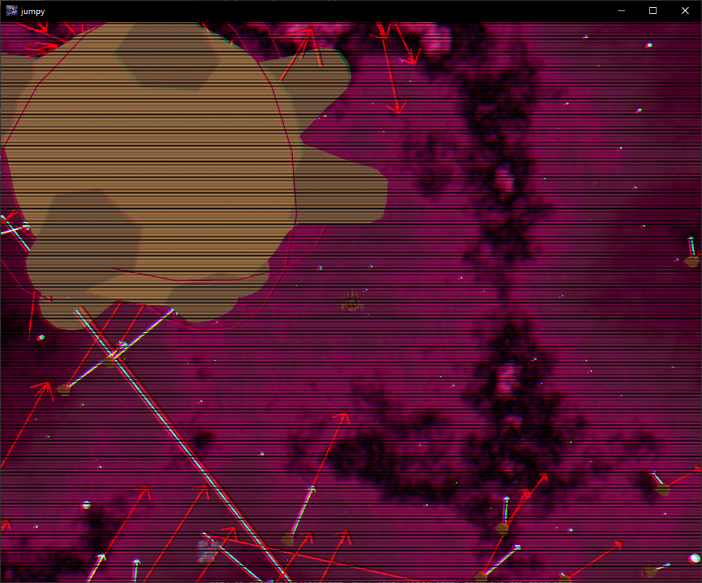

# Rust Game (jumpy)



Based on the tutorial by [Zymartu Games](https://www.youtube.com/watch?v=B6ZFuYYZCSY&list=PL2wAo2qwCxGDp9fzBOTy_kpUTSwM1iWWd)

Assets via [Ultimate Space Kit by Quaternius via Poly Pizza](https://poly.pizza/bundle/Ultimate-Space-Kit-YWh743lqGX)

## Run locally

- Clone the repository

```bash
  git clone https://github.com/samclane/rust-game.git
  cd rust-game
```

- Assuming you have Rust [installed](https://www.rust-lang.org/tools/install), run the following command

```bash
  cargo run
```

## Run release binaries

 - Download the release from the [releases](https://github.com/samclane/rust-game/releases)


- Extract the release and run the executable

```bash
  unzip jumpy-{platform}-{version}.zip -d jumpy
  cd jumpy
  ./jumpy.exe
```

## Controls

- `W` to accelerate the ship forward
- `A` to rotate the ship left
- `D` to rotate the ship right
- `S` to accelerate the ship backwards
- `Space` to shoot bullets
- `Esc` to pause
- `G` to toggle debug "gizmos"
- `Scroll` to zoom in/out
